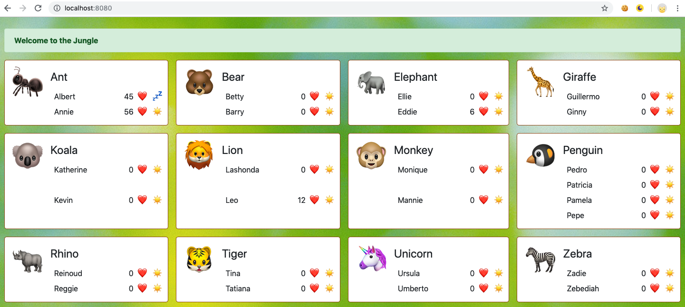
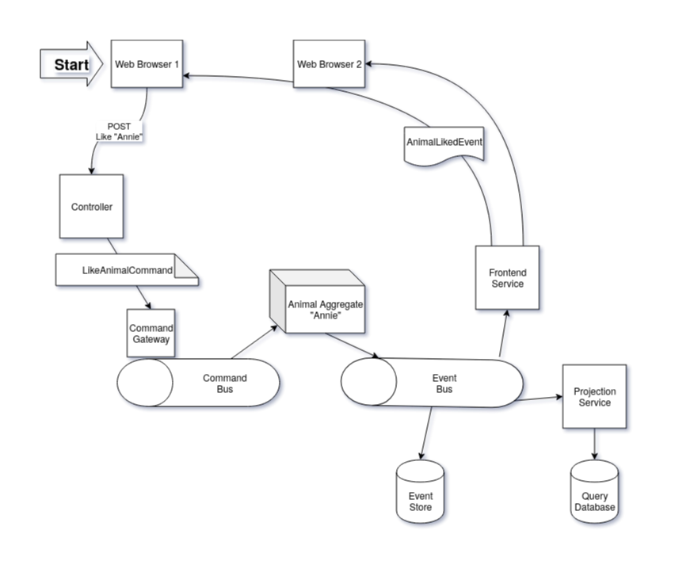

# Zoo

An Axon / Event Sourcing / CQRS sample project.

## Installation

### Requirements

* Docker-compose
* Java 8
* Curl (optional, for demo data)

### Starting the application

#### Database

Create a running mariadb installation using the docker-compose file in the /database directory.

    cd database && docker-compose up

Wait until it says:

    paul-mysql | 2020-01-29 20:01:28 0 [Note] mysqld: ready for connections.
    paul-mysql | Version: '10.4.11-MariaDB-1:10.4.11+maria~bionic'  socket: '/var/run/mysqld/mysqld.sock'  port: 3306  mariadb.org binary distribution

#### Web application

Start the application using maven

    mvn spring-boot:run

#### Demo data

To create sample data send a post request to "/create-demo-data".

    curl -X POST http://localhost:8080/create-demo-data
    
#### Use application

Go to <http://localhost:8080>

#### Cleanup

To remove the database:

    docker-compose down && docker volume rm paul-mysql
    

## Functionality overview

This web application manages a zoo.
The zoo consists of pens, which containing animals.

The animals can be made to sleep or woken up.
If the animal is awake it can be liked.

Changes in the gui are sent to all web browsers connected to the same server.

## Architecture overview

### Frontend
The frontend is a Vuejs application that uses the zoo rest api to read/write data.
It uses stompjs to listen to data updates.

### Backend
The backend is implemented as a spring boot application that exposes a rest api to manage the zoo.
The backend uses Axon to process updates. Updates come in as commands, that are sent to aggregates.
An Aggregate handles the command which may result in zero or more events.
Events are published on the event bus.
Event listeners then modify the projection tables and send events to the connected frontends.

### Like Flow
The following is what happens if a user clicks on the 'like' button in the frontend.

When a user pushes a like button in the web page this results in a POST request to the like animal endpoint.
This endpoint sends a LikeAnimalCommand to the CommandGateway which puts it on the Command Bus.
Axon then sends the command to the correct aggregate instance.
The aggregate checks the command for correctness and if it approves the command it creates zero or more events, stores these and puts these on the event bus.

When the projection service recieves this like event it updates the Animal table, setting the nr of likes to the new number.
When the frontend event service receives this like event it sends a frontend event to each connected web client.

